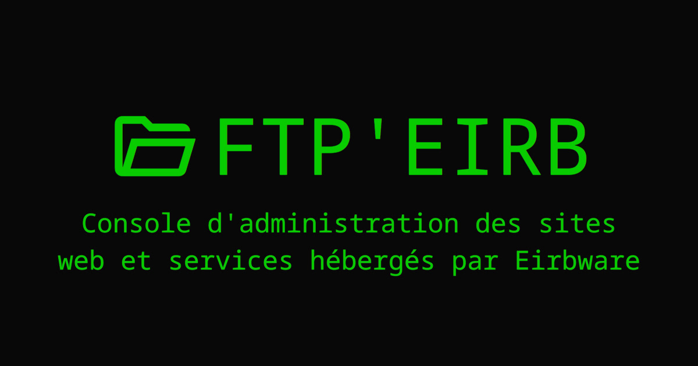

# FTP'eirb

## Gestionnaire de sites, d'utilisateurs et d'accès par FTP aux sites web et services hébergés par Eirbware

\
📦 Installation
================

### Étape 1 : Cloner le projet
``` bash
git clone https://github.com/Eirbware/ftp.eirb.fr.git
```

### Étape 2 : Installer les dépendances du projet avec le gestionnaire de dépendances `composer`
``` bash
cd ftp.eirb.fr/
composer install
```

Après cette étape, l'installation est terminée, mais il reste à configurer le projet. Tout est expliqué dans la section suivante.

\
⚙️ Configuration
=================

Avant de pouvoir lancer le projet et l'essayer, il est nécessaire de renseigner plusieurs variables d'environnement dans un fichier de configuration `.env`, puis de créer la base de données.

## Variables possibles :
* **MYSQL_DB_NAME** (*Chaîne de caractères, requise*): Nom de la base de données.
* **MYSQL_DB_USERNAME** (*Chaîne de caractères, requise*): Nom d'un utilisateur de la base de données.
* **MYSQL_DB_PASSWORD** (*Chaîne de caractères, requise*): Mot de passe de l'utilisateur de la base de données.
* **MYSQL_DB_HOST** (*Chaîne de caractères, requise*): Adresse du serveur de la base de données.
* **MYSQL_DB_PORT** (*Entier, requis*): Port du serveur de la base de données.
* **ACCESS_DURATION** (*Entier, requis*): Durée de validité d'un accès FTP en minutes.

## Exemple de fichier de configuration `.env` :
```env
MYSQL_DB_NAME=ftp_eirb
MYSQL_DB_USERNAME=ftp_eirb
MYSQL_DB_PASSWORD=ftp_eirb
MYSQL_DB_HOST=127.0.0.1
MYSQL_DB_PORT=3306
ACCESS_DURATION=10
```

Ce fichier pourra être créé automatiquement en utilisant la commande suivante :
```bash
composer db-create
```

Cet utilitaire vous demandera les informations nécessaires à la création du fichier de configuration, puis créera la base de données et les tables nécessaires au fonctionnement du projet. Il vous sera ensuite demandé si vous souhaitez créer un compte administrateur par défaut, qui vous permettra de vous connecter à l'application. Si vous acceptez, il vous sera demandé de renseigner un nom d'utilisateur, un prénom et un nom. Il n'y a pas de notion de mot de passe car l'authentification se fait via le serveur CAS de Bordeaux INP.

Une fois ce fichier `.env` créé et la base de données générée, il ne reste plus qu'à lancer le projet !

\
💻️ Développement
================

Pour lancer le projet en local à des fins de développement, il vous suffit de lancer le serveur à la racine du projet :
```bash
composer start
```
Il vous suffit d'aller à l'URL http://localhost:8080/ pour accéder à l'application.

\
🚀️ Déploiement
===============

Pour déployer le projet end production, quelques étapes supplémentaires sont nécessaires.

Voici un exemple de configuration Apache pour déployer le projet :
```apache
<VirtualHost *:443>
        ServerName ftp.eirb.fr

        SSLEngine On

        SSLCertificateFile "/etc/letsencrypt/live/eirb.fr/fullchain.pem"
        SSLCertificateKeyFile "/etc/letsencrypt/live/eirb.fr/privkey.pem"

        Include security_params

        FallbackResource /index.php
        ProxyPassMatch ^/(.*\.php)$ unix:/run/php/php7.4-fpm.ftp.sock|fcgi://localhost/srv/web/sites/ftp/ftp.eirb.fr/public_html

        DocumentRoot /srv/web/sites/ftp/ftp.eirb.fr/public_html
        
        ErrorLog ${APACHE_LOG_DIR}/ftp.eirb.fr.error.log
        CustomLog ${APACHE_LOG_DIR}/ftp.eirb.fr.access.log combined

        <Directory /srv/web/sites/ftp/ftp.eirb.fr/public_html>
                Options -Indexes -Includes -FollowSymLinks
                Require all granted
                <LimitExcept GET POST HEAD OPTIONS PUT DELETE PATCH>
                        Deny from all
                </LimitExcept>
        </Directory>

        SecRuleRemoveById 949110
        SecRuleRemoveById 980130
</VirtualHost>
```

\
👥 Contributeurs
================
- Alexandre Boin ([alexboin](https://github.com/alexboin))
- Antoine Lerner ([takebackfr](https://github.com/takebackfr))
